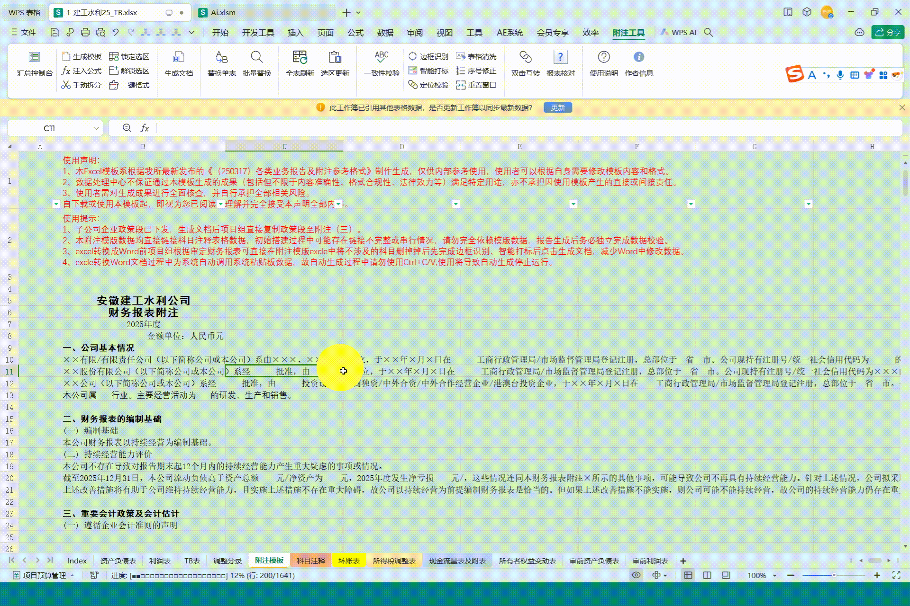
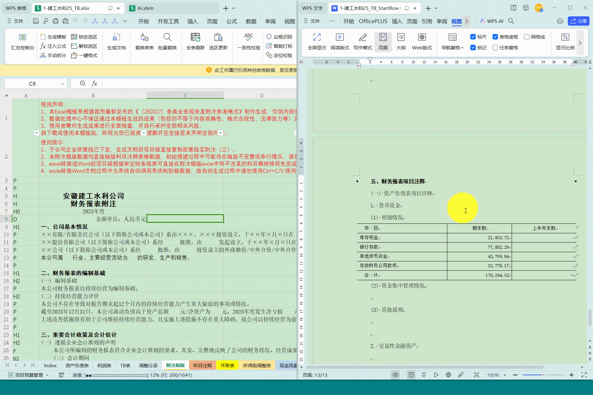
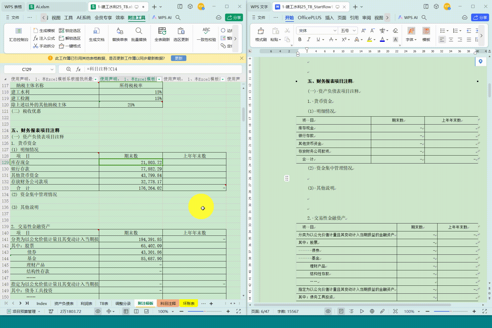
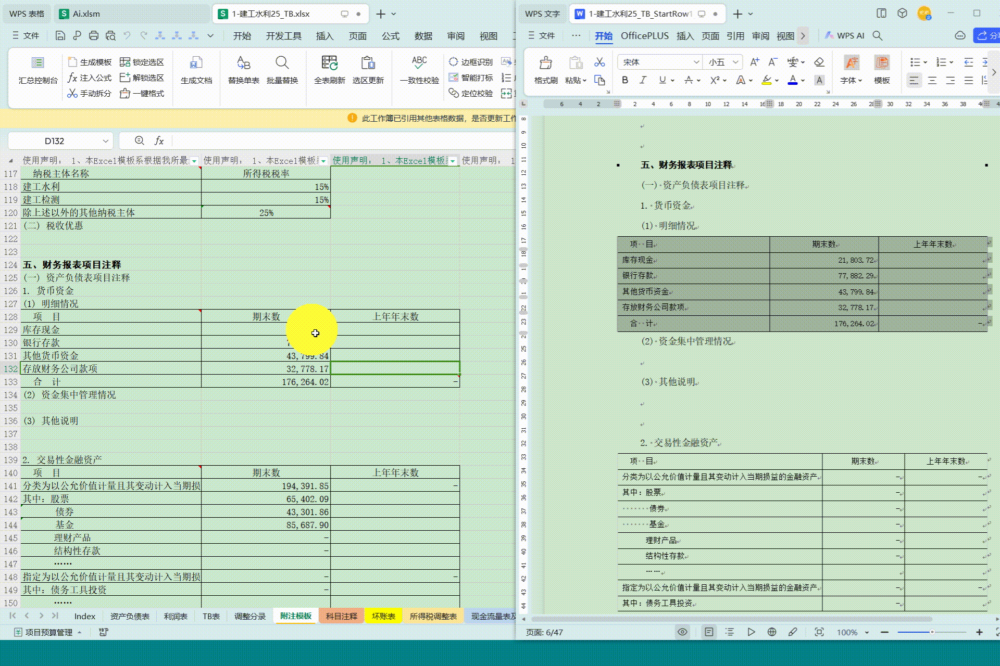
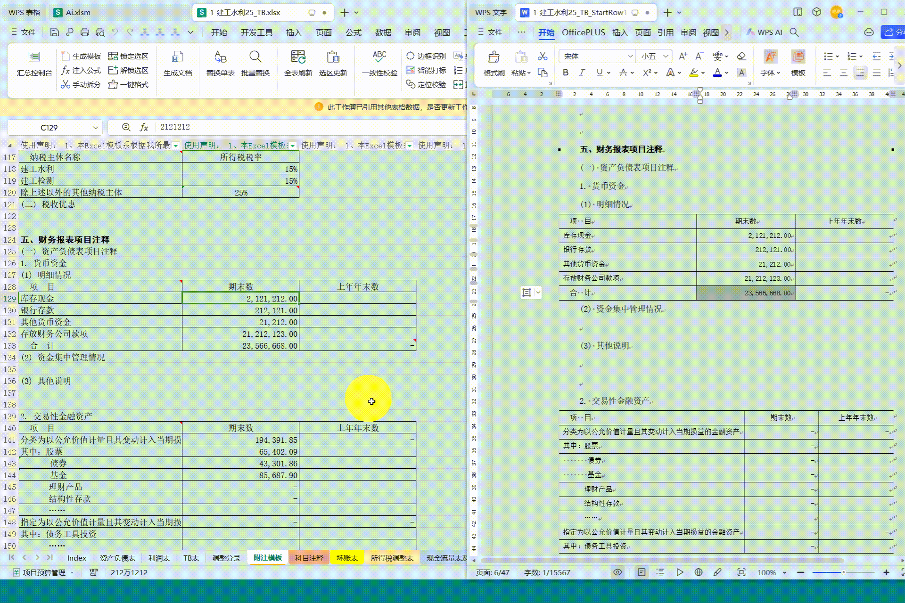
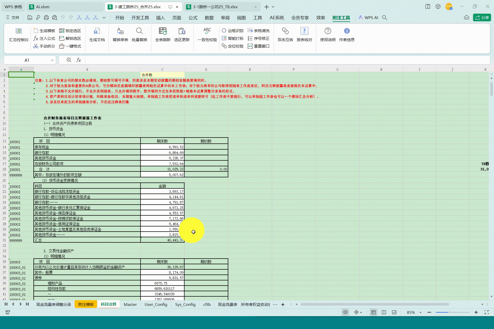
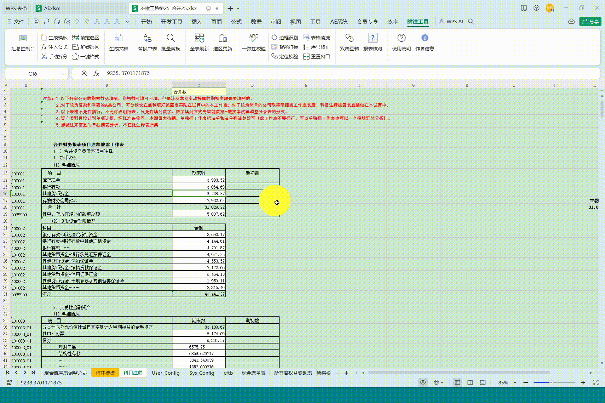
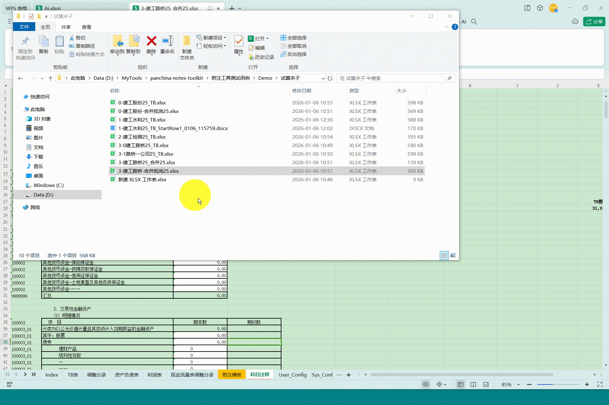
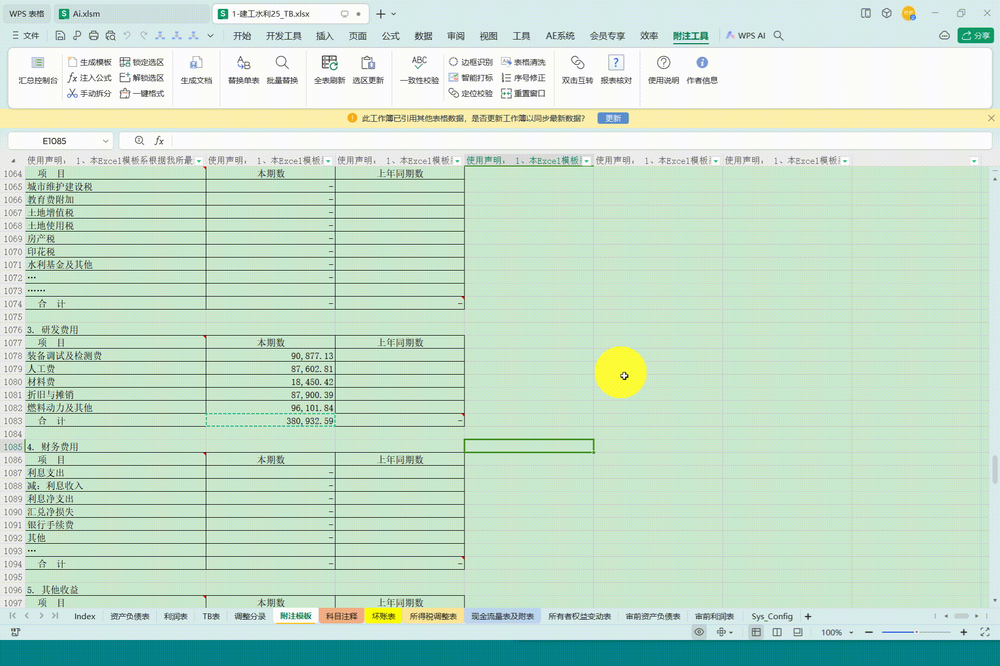
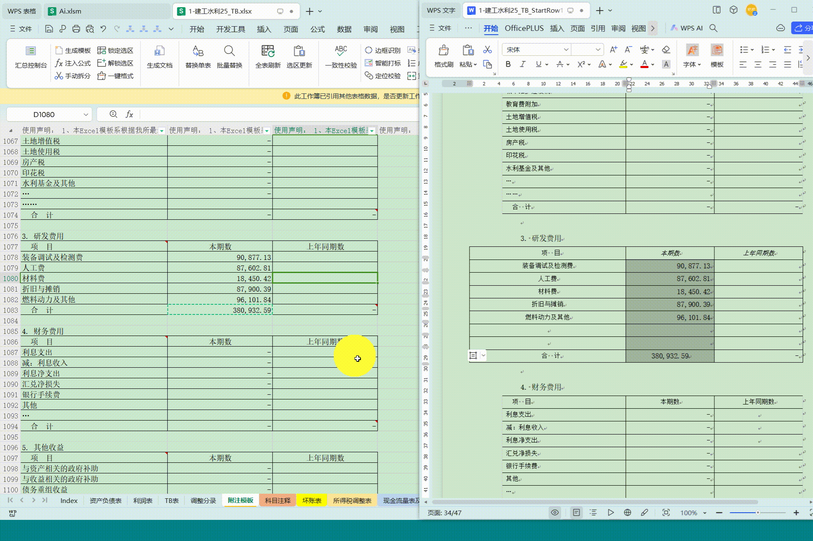

# 天健附注工具箱 (PanChina Notes Toolkit)

  

> **专为审计师打造的“最后最后一公里”解决方案**  
> An advanced Excel Add-in for automating financial audit report generation and data aggregation.

[功能演示](#功能演示) | [安装指南](#安装指南) | [使用手册](#使用流程) | [常见问题](#常见问题)

---

## 📖 项目简介 (Introduction)

**天健附注工具箱** 是一款基于 VBA 开发的 Excel 插件 (`.xlam`)，旨在解决财务报表附注编制中的两大痛点：**繁琐的 Word 排版** 与 **海量单体数据的汇总**。

它打通了 Excel 与 Word 的壁垒，实现了数据的结构化流转与双向交互。

**核心价值：**
*   🚀 **一键生成**：从 Excel 底稿自动生成格式完美的 Word 报告。
*   🔄 **无损刷新**：修改数据后一键刷新，**完美保留**人工调整后的 Word 格式（边框/字体/底纹）。
*   📊 **企业级汇总**：内置 ETL 引擎，轻松抓取数十家子公司的底稿数据，生成合并报表数据库。
*   ⚡ **极客体验**：支持 Excel/Word 双击互转，瞬间定位数据源头。

---

## 📺 功能演示 (Features Demo)

### 1. 报告自动化：一键生成 (One-Click Generation)
告别复制粘贴。智能识别表格结构，自动分屏生成文档。

**操作演示 (Operation):**

**最终效果 (Final Result):**

### 2. 核心黑科技：无损刷新 (Lossless Refresh)
数据变了？别怕。点击刷新，数值更新，但您辛苦调整的格式（标红、加粗）纹丝不动。

**结构替换模式 (Replace Mode):**

**单表精准更新 (Single Table Update):**

**批量选区更新 (Batch Update):**

### 3. 数据工厂：多文件汇总 (Aggregation)
几十个子公司的底稿，一键清洗入库，自动生成合并抵消分录公式。

**Step 1: 基础表准备 (Preparation)**

**Step 2: 批量抓取 (Batch Import)**

**Step 3: 公式注入 (Formula Injection)**

**Step 4: 合并抵消 (Consolidation)**

### 4. 双向溯源 (Traceback)
在 Word 中双击数据，瞬间跳回 Excel 底稿；在 Excel 双击，瞬间跳去 Word。

### 5. 更多辅助功能 (Auxiliary Tools)
内置表格清洗、自动序号修订等实用小工具，解决排版琐事。

自动序号修订

---

## 🛠️ 安装指南 (Installation)

1.  **下载**：点击右侧 Releases 下载最新版 `天健附注工具箱.xlam`。
2.  **安装**：
    *   **推荐**：打开 `一键安装.xlsm`，点击“安装插件”按钮。
    *   **手动**：将 `.xlam` 文件放入 Excel 加载项目录 (`%AppData%\Microsoft\AddIns`)，并在 Excel“开发工具”->“Excel 加载项”中勾选它。
3.  **环境要求**：
    *   Windows 10 / 11
    *   **WPS Office 专业版** (需安装 VBA 模块) 或 Microsoft Excel 2010+

---

## 🚀 使用流程 (Workflow)

### 模块一：报告生成
1.  **打标**：在 Excel“附注模板”表中，点击 **[边框识别]** -> **[智能打标]**。
2.  **生成**：点击 **[生成文档]**，程序自动输出 Word 初稿。
3.  **维护**：数据变动后，选中区域点击 **[选区更新]**。

### 模块二：数据汇总
1.  **启动**：点击 **[启动控制台]**。
2.  **抓取**：选择包含所有单体底稿的文件夹，点击 **[开始抓取]**。
3.  **应用**：在合并底稿中使用 **[公式注入]**，自动引用汇总数据。

---

## ⚠️ 注意事项 (Notes)

1.  **WPS 用户**：请确保您的 WPS 安装了 **VBA 宏支持库**（部分个人版默认未安装）。
2.  **双击互转**：
    *   首次使用需先运行一次“生成文档”或在设置中开启 `Link_Word_Excel` 开关。
    *   Excel 端仅支持在名为 `附注模板` 的工作表中触发。
3.  **数据安全**：本插件完全离线运行，所有数据均在本地处理，绝不上传云端。

---

## 🤝 贡献与反馈 (Contribution)

欢迎提交 Issue 或 Pull Request！
*   开发环境建议使用 **WPS Office** 以确保最大兼容性。
*   提交代码前请运行 `Mod_GitExporter` 导出源码。

**License**: MIT License
Copyright (c) 2025 Dota (PCCPA)
